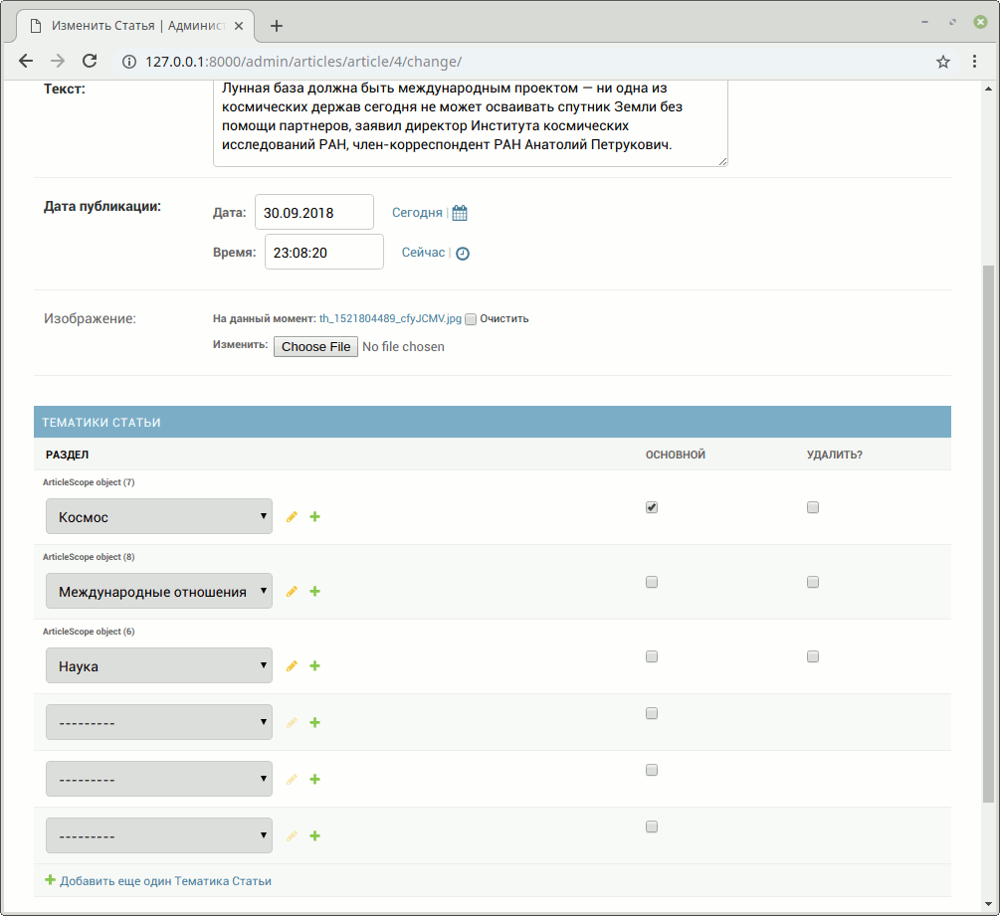

# Связь многие-ко-многим

## Задание <a href="#doc">(Мое решение)</a> 

Есть небольшой новостной сайт.


Было решено к статьям добавить тематические резделы, к которым они относятся, и отображать их у каждой новости в виде списка тегов.


У каждой статьи может быть несколько разделов, но всегда один из них должен быть основным.
В списке тегов он должен идти первым, потом все остальные в алфавитном порядке.

В админке необходимо реализовать создание разделов
и для страницы _Редактирование статьи_ добавить возможность указывать разделы.
Необходимо так же реализовать проверку на наличие одного и только одного основного раздела.



## Примечание

* `Tag` - просто тег, только его название, ничего более.
* `Article` - статья с текстом, заголовком, картинкой и пр. + набор тегов (многие ко многим)
* `Scope` - таблица связка между статьей и тегом. Именно здесь должно быть свойство `is_main`

---

Вам нельзя менять шаблон! Ваша задача реализовать модели и логику так, чтобы текущий шаблон заработал (используйте `related_name`). 

<a name="doc"></a>

## Документация по проекту

Для запуска проекта необходимо:

Установить зависимости:

```bash
pip install -r requirements.txt
```

Создать базу данных в соответствии с настройками в файле <a href="https://github.com/RavenRVS/DJ_HW4_T2/blob/master/website/settings.py">settings.py</a> или заменить настройки базы данных на свои.

Провести миграцию:

```bash
python manage.py migrate
```

Загрузить тестовые данные:

```bash
python manage.py loaddata articles.json
```

Запустить отладочный веб-сервер проекта:

```bash
python manage.py runserver
```
